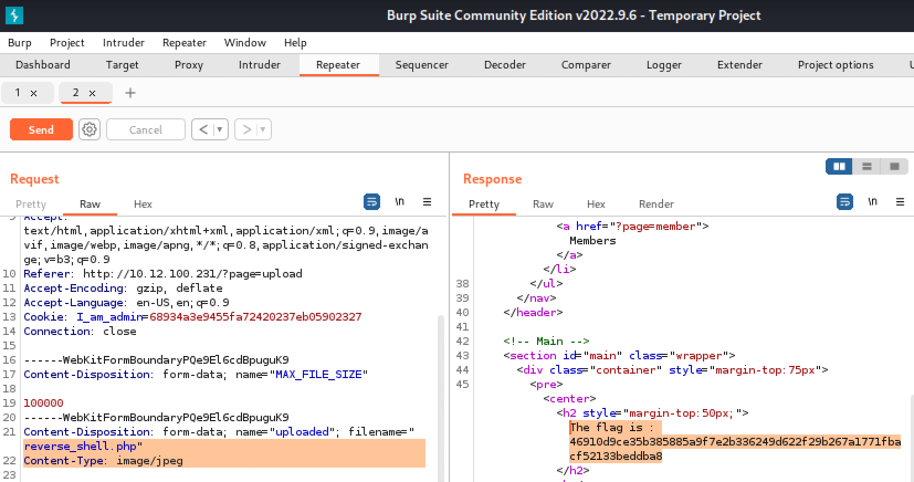

Upload Vulnerabilities / Bypassing File Upload

we will use Burp Suite to get around the restrictions 
we're only allowed to upload JPEGs, so we're going to have to change the value of "Content-Type". We'll change it to "image/jpeg" so we can disguise our file as an image.

[Bypass File Upload Restrictions Using Burp Suite](https://null-byte.wonderhowto.com/how-to/bypass-file-upload-restrictions-using-burp-suite-0164148)

## # Prevention

1. Rewriting or obfuscating file names will make it harder for an attacker to locate a malicious file once they have uploaded it.

2. Make sure you check the file extension of uploaded files against a white-list of permitted file types. Do this on the server-side.