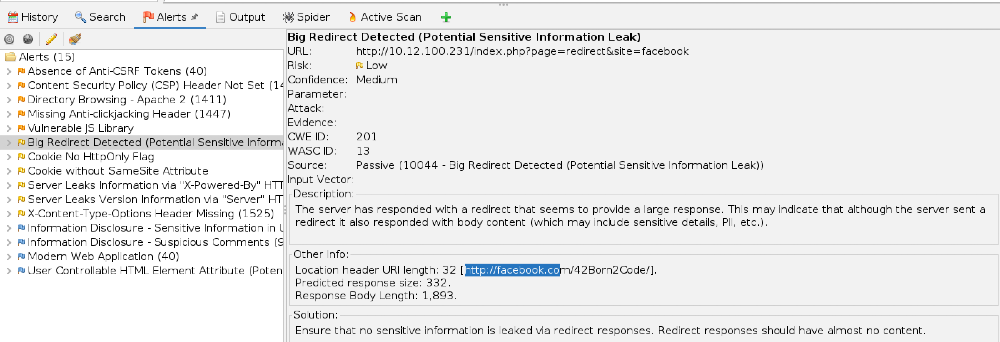
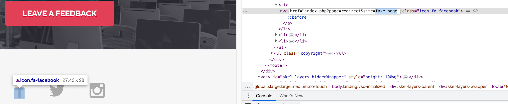

at the Enumeration phase, when using OWASP ZAP for possible vulnerabilities

the three icons at the bottom can be exploited to redirect to a phishing link

using inspect

then click the fake link

GOOD JOB HERE IS THE FLAG : B9E775A0291FED784A2D9680FCFAD7EDD6B8CDF87648DA647AAF4BBA288BCAB3