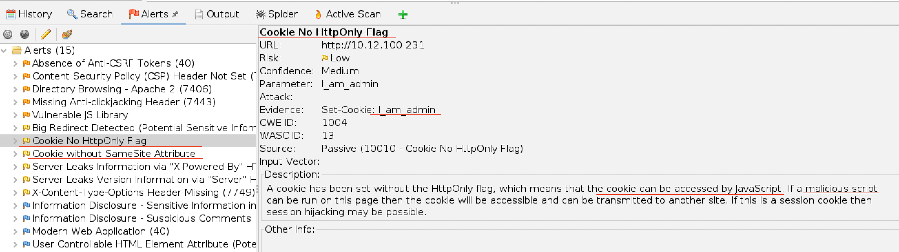

when using OWASP for possible vulnerabilities

we will notice there is something wrong about cookies




HTTPOnly is a flag that can be set on a cookie to indicate that it should only be accessible over HTTP or HTTPS and not through client-side scripts such as JavaScript.

When the HTTPOnly flag is set on a cookie, it helps to prevent cross-site scripting (XSS) attacks by making it more difficult for an attacker to steal the cookie and use it to impersonate the user or perform other malicious actions.

If a cookie does not have the HTTPOnly flag set, it can be accessed by client-side scripts, which can make it more vulnerable to XSS attacks. An attacker can use JavaScript to steal the cookie and send it to a different domain, allowing them to impersonate the user or perform other malicious actions on their behalf.

the i_am_admin cookie has value as `68934a3e9455fa72420237eb05902327`

```
Darkly git:(main) ✗ curl -I http://10.12.100.231/
HTTP/1.1 200 OK
Set-Cookie: I_am_admin=68934a3e9455fa72420237eb05902327
```

when using [Cipher Identifier](https://www.dcode.fr/cipher-identifier) turns out to be md5

when decrypted gives the value `false`, change it to `true`

MD5(true) = b326b5062b2f0e69046810717534cb09

Good job! Flag : df2eb4ba34ed059a1e3e89ff4dfc13445f104a1a52295214def1c4fb1693a5c3
