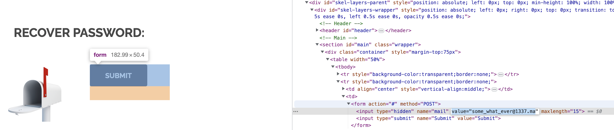

in the RECOVER PASSWORD page 

i changed the recovery email then click submit, triggers the flag

THE FLAG IS : 1D4855F7337C0C14B6F44946872C4EB33853F40B2D54393FBE94F49F1E19BBB0

ok, we can also change hidden to visible
