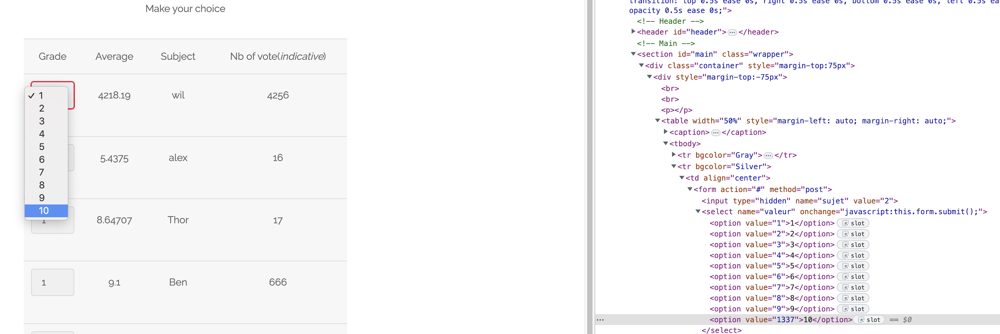

selecting the 10-nth option will trigger the flag

THE FLAG IS `03A944B434D5BAFF05F46C4BEDE5792551A2595574BCAFC9A6E25F67C382CCAA`

## # Prevention

we must check in backend if the value is in the valid range. (1 - 10)